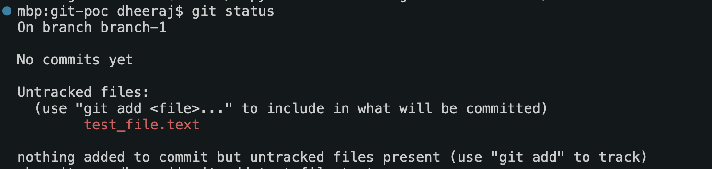

Git
  Branches
      checkout : To switch to different branch
      
      checkout -b : Create and switch to a new branch
      
  Status:
    git status
    - Without adding changes 
     

    - After adding changed
    

  Commit:
    git commit -m <Message>
    - After commiting
    
    
  Log:
    git log
    

  Merge: merge changes from other branch to this branch
    

